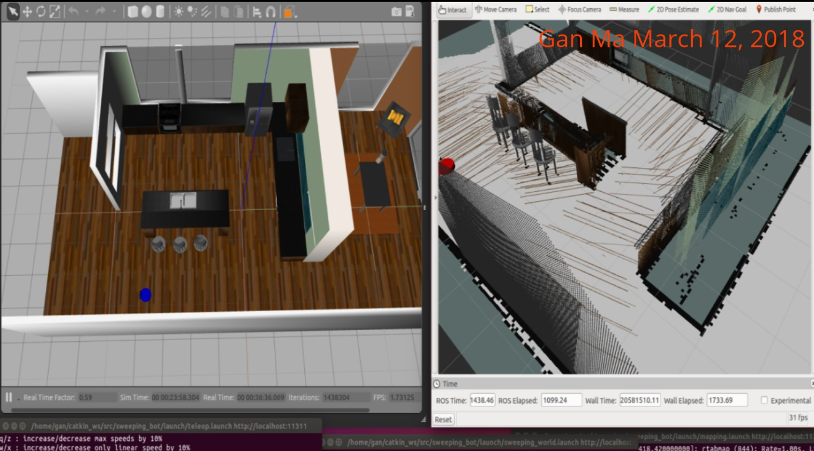

# RoboND-SLAM-Project
## Abstract
This project implements SLAM (Simulaneous localization and mapping) with RTAB-Map (Read-Time Appearance-Based Mapping) approach.  Please refer to [writeup](https://github.com/mgangster/RoboND-SLAM-Project/blob/master/Writeup.pdf) for explanation on code.

## Project Setup
First, downloads the repo to your Computer:
```sh
$ cd ~/catkin_ws/src
$ git clone https://github.com/mgangster/RoboND-SLAM-Project.git
$ mv RoboND-SLAM-Project sweeping_bot
```
For this setup, catkin_ws is the name of active ROS Workspace, if your workspace name is different, change the commands accordingly. 
If you do not have an active ROS workspace, you can create one by:

```sh
$ mkdir -p ~/catkin_ws/src
$ cd ~/catkin_ws/
$ catkin_make
```

Build the project:
```sh
$ cd ~/catkin_ws
$ catkin_make
```
Source the terminal:
```
source ~/catkin_ws/devel/setup.bash
```

To run the program:
```sh
$ cd ~/catkin_ws
$ roslaunch sweeping_bot sweeping_world.launch
$ roslaunch sweeping_bot teleop.launch
$ roslaunch sweeping_bot mapping.launch
$ roslaunch sweeping_bot rviz.launch
```
Once you run the program, you can use your keyboard to control the robot mapping the world.


